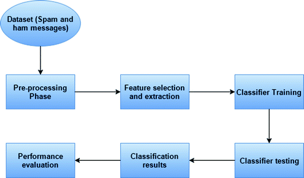

# Spam-Classifier

  

## 📌 Introduction:-

A Natural Language Processing with SMS Data to predict whether the SMS is Spam/Ham with various ML Algorithms like multinomial-naive-bayes,logistic regression,svm,decision trees to compare accuracy and using various data cleaning and processing techniques like PorterStemmer,CountVectorizer,TFIDF Vetorizer,WordnetLemmatizer.

## WorkFlow:-

## 🏁 Datasets Used:-
* The dataset used is SMS Spam Dataset created by UCI Machine Learning.This dataset is downloaded in kaggle.You can download it [here](https://www.kaggle.com/uciml/sms-spam-collection-dataset/download).
* Reference for this dataset can be found [here](http://www.dt.fee.unicamp.br/~tiago/smsspamcollection/)
## 📧Contact:-
For any kind of suggesstions/ help in models code Please mail me at ksdkamesh99@gmail.com.

## 📜 LICENSE
[MIT](https://github.com/ksdkamesh99/Spam-Classifier/blob/master/LICENSE)
